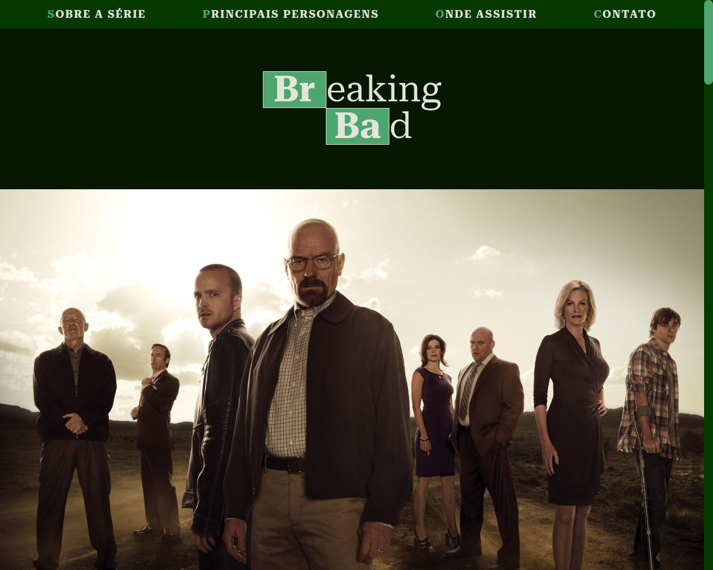
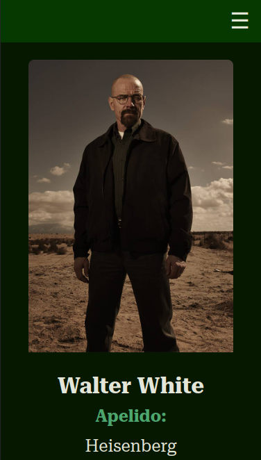
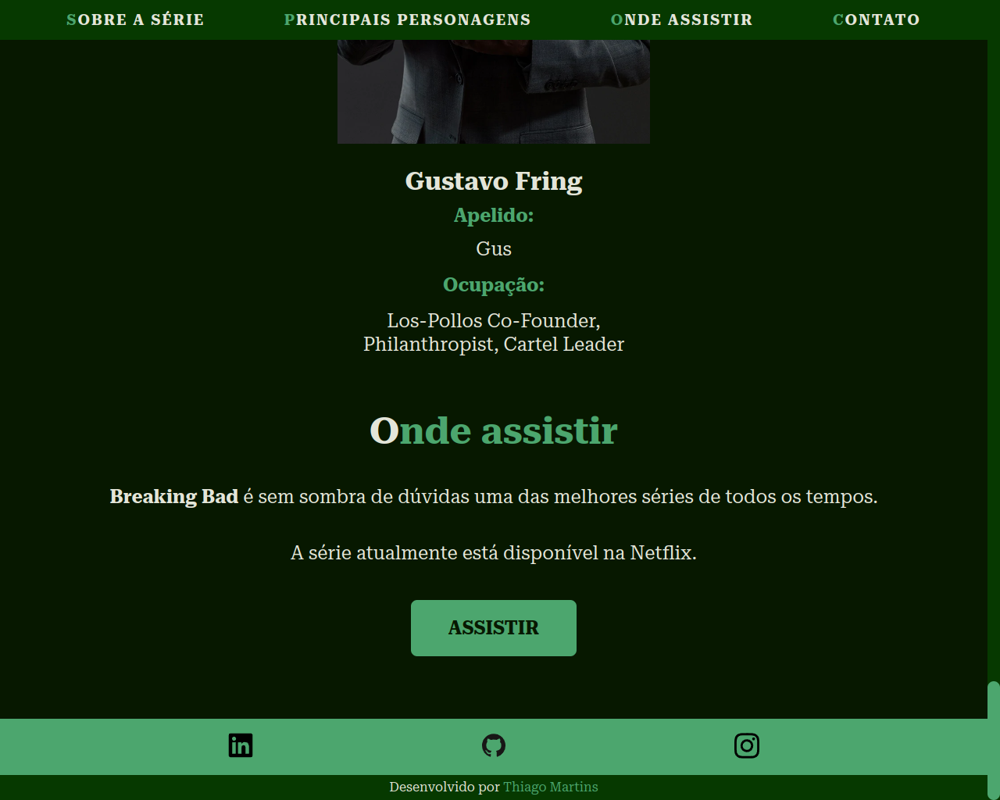

# Breaking Bad Landing page

- O projeto foi desenvolvido com Html, Css e Javascript.

## Índice

- [Visão Geral](#visao-geral)
  - [A ideia](#a-ideia)
  - [Screenshot](#screenshot)
  - [Links](#links)
  - [Como rodar o projeto](#como-rodar-o-projeto)
- [Meu processo](#meu-processo)
  - [Construído com](#construido-com)
  - [O que eu aprendi](#o-que-eu-aprendi)
- [Autor](#autor)

## Visao Geral

### A ideia

Quando descobri que minha série favorita tinha uma API, tive que fazer um projeto simples.

### Screenshot





### Links

- URL do repositório: [Código](https://github.com/thiagoa-martins/breaking-bad)

### Como rodar o projeto

- Acesse o site: [Site](https://thiagoa-martins.github.io/breaking-bad/)

## Meu processo

### Construido com

- Marcação HTML5 semântica
- Propriedades personalizadas de CSS
- Flexbox
- Primeiro fluxo de trabalho para desktop
- Javascript


### O que eu aprendi

Neste projeto pude aprender a fazer um "menu hamburguer", eu ainda não tinha feito nenhum sozinho e foi muito divertido. Esse menu, assim como a versão desktop também estão fixos na tela.

```html
<div class="menu-mobile" id="menuMobile">
    <nav>
        <ul class="menu">
            <li>
                <a href="#about-the-serie"><span class="chemical-element">s</span>obre a série</a>
            </li>
            <li>
                <a href="#main-characters"><span class="chemical-element">p</span>rincipais personagens</a>
            </li>
            <li>
                <a href="#where-to-watch"><span class="chemical-element">o</span>nde assistir</a>
            </li>
            <li>
                <a href="#contact"><span class="chemical-element">c</span>ontato</a>
            </li>
        </ul>
    </nav>
</div>
```

```css
.header nav .hamburger {
    display: inline-block;
    position: absolute;
    top: 27%;
    right: 1rem;
    font-size: 2rem;
    cursor: pointer;
    z-index: 1;
}

.header nav .menu-mobile {
    display: none;
    transition: 200ms all;
}

.header nav .menu-mobile.show {
    display: inline-block;
    position: absolute;
    top: 0;
    background-color: var(--color-ternary);
    width: 100%;
    opacity: 0.9;
}
```

```js
const showCharacters = response => {
    const array = response;
    const numberOfCharacters = 8;

    let card = "";

    for (let i = 0; i <= numberOfCharacters; i++) {
        const img = array[i].img;
        const name = array[i].name;
        const nickname = array[i].nickname;
        const occupation = array[i].occupation.join(", ");

        card += `
            <div class="card">
                
                    
                <h3>${name}</h3>
                <h4 class="nickname">apelido:</h4>
                <span>${nickname}</span>
                <span class="occupation">ocupação:</span>
                <span>${occupation}</span>
            </div>  
        `;
    }

    divCards.innerHTML = card;
};
```

## Autor

- Github - [thiagoa-martins](https://github.com/thiagoa-martins)
- Linkedin - [thiagoa-martins](https://www.linkedin.com/in/thiagoa-martins/)
